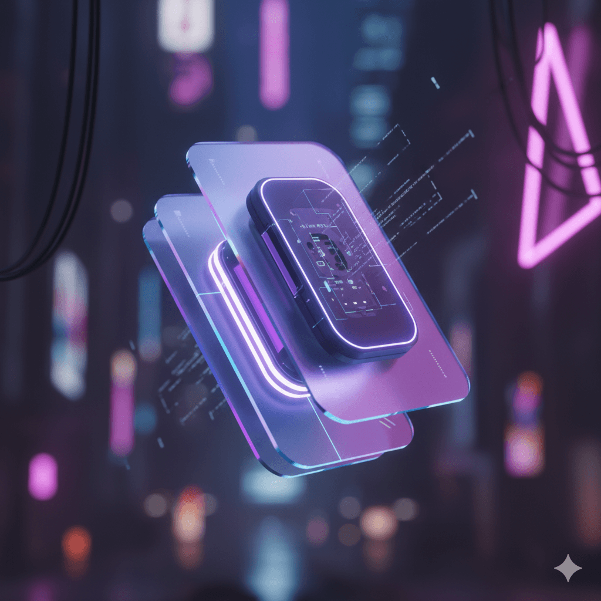
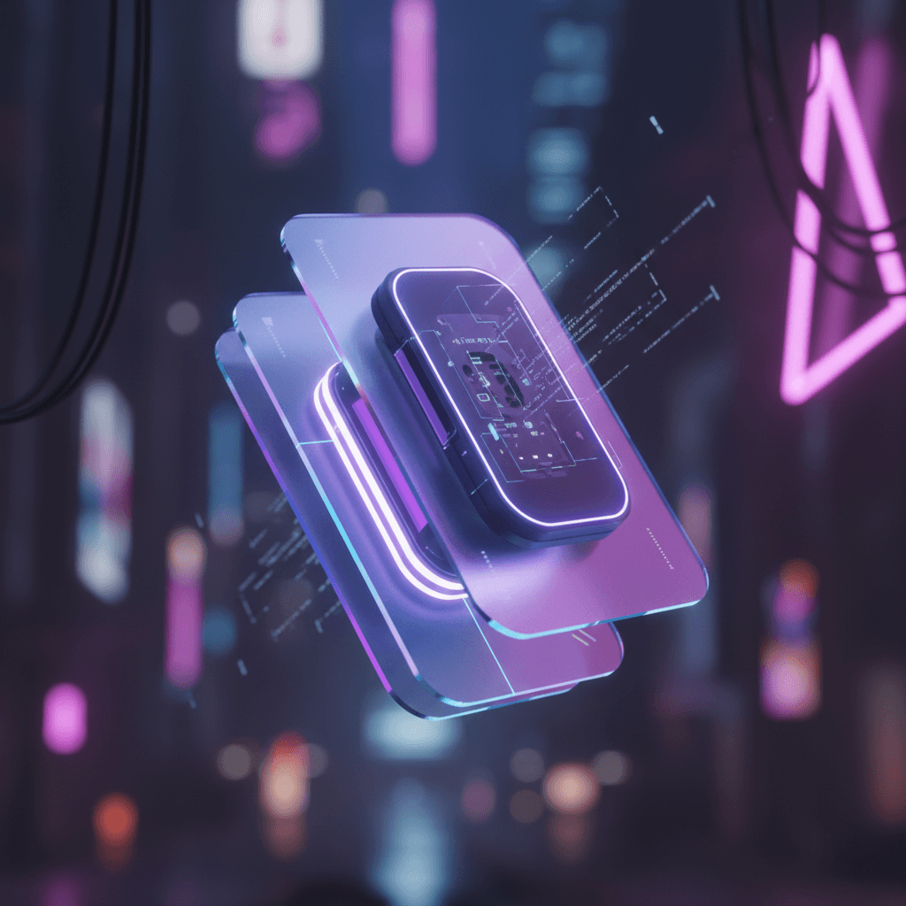

<div align="center">
  
  
  <h1>RemoveGemini.com</h1>
  
  <p><strong>Free, Privacy-First AI Watermark Removal Tool</strong></p>
  <p>Premium Next.js application with AAA design standards</p>

[](LICENSE)
[](https://nextjs.org/)
[](https://www.typescriptlang.org/)
[](https://tailwindcss.com/)

</div>

---

## 🌟 Overview

RemoveGemini.com is a cutting-edge web application that removes Gemini AI watermarks from images using advanced reverse alpha blending algorithms. Built with modern web technologies and designed with a focus on privacy, performance, and user experience.

### ✨ Key Features

- **🔒 100% Privacy-First** - All processing happens in your browser. Zero uploads, zero tracking
- **⚡ Lightning Fast** - Millisecond processing with Web Workers and optimized algorithms
- **💎 AAA Design** - Premium glassmorphism UI with smooth animations
- **🎯 Auto-Processing** - Instant watermark removal on upload
- **📱 Fully Responsive** - Perfect experience on desktop, tablet, and mobile
- **🌐 Multi-Language** - English and Chinese support with i18n
- **🖼️ Batch Processing** - Handle multiple images simultaneously
- **🔍 Zoom Preview** - Click to zoom images for detailed inspection
- **📥 Easy Export** - Download individual images or batch download all

---

## 🚀 Live Demo

**Production:** [https://removegemini.com](https://removegemini.com)

---

## 📸 Live Examples

### Example 1: Neon Cityscape
<table>
<tr>
<td width="50%"><br/><b>Before</b> - With Gemini watermark</td>
<td width="50%"><br/><b>After</b> - Watermark removed cleanly</td>
</tr>
</table>

### Example 2: Hacker Portrait
<table>
<tr>
<td width="50%"><br/><b>Before</b> - With Gemini watermark</td>
<td width="50%"><br/><b>After</b> - Complex watermark removed</td>
</tr>
</table>

### Example 3: Tech Product Shot
<table>
<tr>
<td width="50%"><br/><b>Before</b> - With Gemini watermark</td>
<td width="50%"><br/><b>After</b> - Artifact-free result</td>
</tr>
</table>

---

## 🛠️ Tech Stack

### Frontend Framework
- **Next.js 15** - React framework with App Router
- **TypeScript 5.0** - Type-safe development
- **Tailwind CSS 3.4** - Utility-first styling

### Image Processing
- **Canvas API** - Low-level pixel manipulation
- **Web Workers** - Non-blocking background processing
- **Reverse Alpha Blending** - Advanced watermark removal algorithm

### UI/UX
- **Glassmorphism** - Modern backdrop-blur effects
- **Medium-zoom** - Smooth image zoom interactions
- **CSS Animations** - Hardware-accelerated transforms
- **Gradient System** - Blue → Purple → Pink color palette

### Development
- **SWR** - Data fetching and state management
- **ESLint** - Code quality enforcement
- **Turbopack** - Lightning-fast bundler
- **PNPM** - Efficient package management

---

## 📦 Installation

### Prerequisites
- Node.js 18+ or Bun
- PNPM (recommended) or NPM

### Clone & Install

```bash
# Clone the repository
git clone https://github.com/fame0528/removegemini.git
cd removegemini

# Install dependencies
pnpm install
```

### Development Server

```bash
# Start dev server (http://localhost:3000)
pnpm dev

# With Turbopack
pnpm dev --turbo
```

### Build for Production

```bash
# Create optimized build
pnpm build

# Preview production build
pnpm start

# Export static files
pnpm build && pnpm export
```

---

## 📂 Project Structure

```
removegemini/
├── src/
│   ├── app/                    # Next.js App Router
│   │   ├── globals.css        # Global styles & animations
│   │   ├── layout.tsx         # Root layout with metadata
│   │   └── page.tsx           # Home page
│   ├── components/            # React components
│   │   ├── Header.tsx         # Navigation with logo & language switcher
│   │   ├── Footer.tsx         # Links and branding
│   │   ├── WatermarkRemover.tsx   # Main app orchestration
│   │   ├── UploadArea.tsx     # Drag & drop file upload
│   │   └── ImagePreview.tsx   # Side-by-side comparison
│   ├── lib/                   # Core logic
│   │   ├── core/              # Watermark removal engine
│   │   │   ├── watermarkEngine.ts  # Main algorithm
│   │   │   ├── alphaMap.ts         # Alpha channel detection
│   │   │   └── blendModes.ts       # Blend mode calculations
│   │   ├── hooks/             # React hooks
│   │   │   └── useWatermarkEngine.ts  # State management
│   │   ├── utils/             # Helper functions
│   │   │   └── imageUtils.ts       # Image processing utilities
│   │   └── i18n.ts            # Internationalization
│   └── types/                 # TypeScript definitions
│       ├── index.ts           # Exported types
│       └── images.d.ts        # Image-related types
├── public/                    # Static assets
│   ├── bg_48.png              # Watermark patterns (48x48)
│   ├── bg_96.png              # Watermark patterns (96x96)
│   └── terms.html             # Terms of use page
├── dev/                       # ECHO Development Tracking
│   ├── planned.md             # Upcoming features
│   ├── progress.md            # Active development
│   ├── completed.md           # Finished features
│   ├── roadmap.md             # Strategic direction
│   ├── architecture.md        # Technical decisions
│   └── QUICK_START.md         # Current project state
└── docs/                      # Documentation & screenshots
```

---

## 🎯 How It Works

### Watermark Removal Algorithm

RemoveGemini.com uses a sophisticated **reverse alpha blending** algorithm:

1. **Detection Phase**
   - Scan image for watermark patterns (48x48 or 96x96)
   - Identify alpha channel values
   - Map watermark position and coverage

2. **Analysis Phase**
   - Calculate inverse blend modes
   - Determine optimal reconstruction parameters
   - Build alpha restoration map

3. **Processing Phase**
   - Apply reverse blending per pixel
   - Reconstruct original RGB values
   - Remove watermark artifacts

4. **Optimization Phase**
   - Smooth boundaries
   - Color correction
   - Final quality enhancement

### Key Components

**WatermarkEngine** (`src/lib/core/watermarkEngine.ts`)
- Core algorithm implementation
- Canvas-based pixel manipulation
- Image smoothing disabled for pixel-perfect processing
- Debug visualization (green box) for troubleshooting
- Web Worker support for performance

**useWatermarkEngine** (`src/lib/hooks/useWatermarkEngine.ts`)
- React state management
- Auto-processing pipeline
- Queue management for batch operations

**ImagePreview** (`src/components/ImagePreview.tsx`)
- Side-by-side comparison
- Medium-zoom integration
- Compact metadata display

### Algorithm Details

**Critical Implementation Notes:**
```typescript
// Disable image smoothing to preserve exact pixel values
ctx.imageSmoothingEnabled = false;
```

The watermark removal algorithm requires **exact pixel-perfect matching**. Canvas image smoothing (browser interpolation) is disabled to ensure RGB values remain unchanged during processing. This is critical for the reverse alpha blending formula to work correctly.

---

## 🎨 Design System

### Color Palette

```css
/* Primary Gradients */
--gradient-blue: #3b82f6 → #8b5cf6 → #ec4899
--background: #0a0a0f (radial gradient overlays)

/* Glassmorphism */
--glass: backdrop-blur(20px) + rgba(255,255,255,0.05)
--glass-light: backdrop-blur(16px) + rgba(255,255,255,0.1)
```

### Animation System

```css
/* Keyframes */
@keyframes float { /* 6s smooth vertical movement */ }
@keyframes glow { /* 3s opacity pulse */ }
@keyframes shimmer { /* Button shine effect */ }
@keyframes spin-slow { /* 3s rotation */ }

/* Utility Classes */
.card-hover { translateY(-8px) + scale(1.02) }
.btn-shine { pseudo-element shimmer on hover }
```

### Typography

- **Headers**: Gradient text with background-clip
- **Sizes**: 5xl-7xl for heroes, 2xl for features
- **Body**: Gray-300/400 with leading-relaxed

---

## 🔧 Development

### Code Quality Standards

- ✅ TypeScript strict mode enabled
- ✅ ESLint with Next.js rules
- ✅ Component-based architecture
- ✅ Comprehensive JSDoc comments
- ✅ Single Responsibility Principle
- ✅ DRY (Don't Repeat Yourself)
- ✅ Utility-first design patterns

### Adding Features

Follow ECHO development methodology:

1. Create FID (Feature ID) in `dev/planned.md`
2. Plan implementation with acceptance criteria
3. Move to `dev/progress.md` when starting
4. Implement with AAA quality standards
5. Test thoroughly (manual + TypeScript verification)
6. Move to `dev/completed.md` with metrics
7. Update `dev/QUICK_START.md`

### Testing

```bash
# Type checking
pnpm typecheck

# Lint code
pnpm lint

# Build verification
pnpm build
```

---

## 📋 Roadmap

See `dev/roadmap.md` for detailed plans.

### Q1 2026
- [ ] Service Worker for offline support
- [ ] PWA (Progressive Web App) capabilities
- [ ] Enhanced batch processing with progress bars
- [ ] Custom watermark pattern support

### Q2 2026
- [ ] API for third-party integration
- [ ] Browser extension (Chrome, Firefox)
- [ ] Advanced editing tools (crop, resize, filters)
- [ ] Comparison slider for before/after

### Q3 2026
- [ ] AI-powered watermark detection
- [ ] Cloud sync (optional, privacy-preserving)
- [ ] Team collaboration features
- [ ] Analytics dashboard

---

## 🤝 Contributing

We welcome contributions! Please follow these guidelines:

1. **Fork** the repository
2. **Create** a feature branch (`git checkout -b feature/AmazingFeature`)
3. **Follow** ECHO development standards
4. **Write** comprehensive commit messages
5. **Test** thoroughly before submitting
6. **Submit** a Pull Request

### Code Standards

- Use TypeScript strict mode
- Follow existing component patterns
- Add JSDoc comments for functions
- Update relevant documentation
- Maintain AAA quality standards

---

## 📄 License

This project is licensed under the MIT License - see the [LICENSE](LICENSE) file for details.

**Copyright © 2026 RemoveGemini.com**

---

## ⚠️ Disclaimer

This tool is provided for **educational and personal use only**. 

- ✅ Use for learning image processing algorithms
- ✅ Use for personal photo editing
- ❌ Do not use for copyright infringement
- ❌ Do not use for commercial purposes without proper rights

**Note:** While this tool removes visible watermarks, it does not affect invisible steganographic watermarks (like [Google's SynthID](https://support.google.com/gemini/answer/16722517)).

---

## 🙏 Acknowledgments

- **Next.js Team** - For the amazing React framework
- **Vercel** - For excellent deployment platform
- **Open Source Community** - For invaluable tools and libraries
- **Contributors** - For helping improve this project

---

## 📧 Contact & Support

- **Website**: [https://removegemini.com](https://removegemini.com)
- **GitHub**: [https://github.com/fame0528/removegemini](https://github.com/fame0528/removegemini)
- **Issues**: [Report bugs or request features](https://github.com/fame0528/removegemini/issues)

---

<div align="center">

**Made with ❤️ by RemoveGemini.com**

⭐ Star us on GitHub if you find this useful!

[Website](https://removegemini.com) • [Documentation](docs/) • [Report Bug](https://github.com/fame0528/removegemini/issues) • [Request Feature](https://github.com/fame0528/removegemini/issues)

</div>
